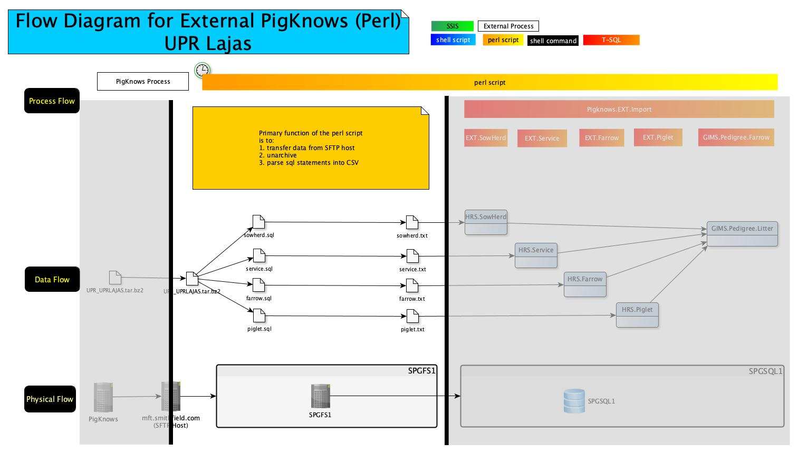
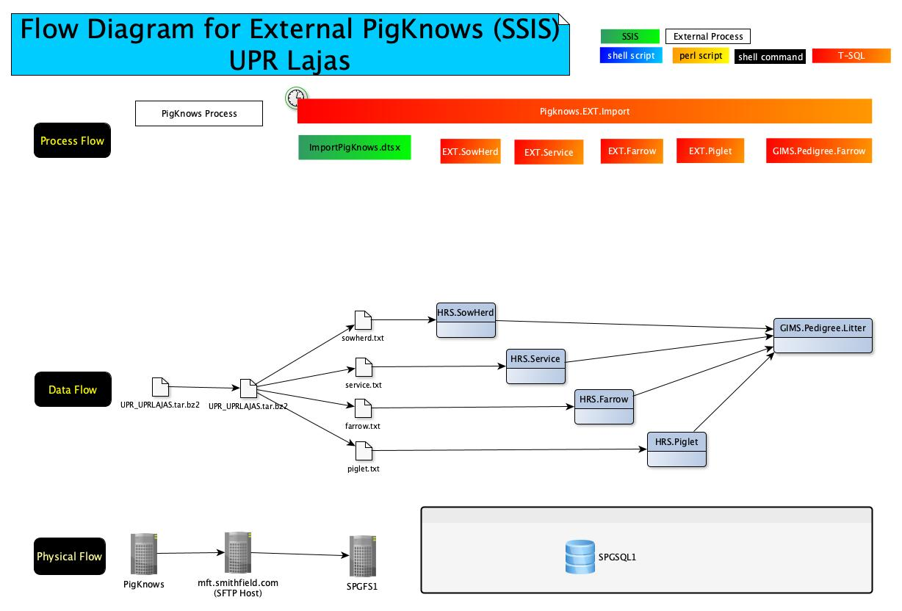

# README_HTML

<h3>Header 1</h3>

    

With the SSIS process, imports of all farms are controlled by a SQL Server scheduled job, <em>pigknowsImport</em>.  That job executes a single stored procedure, <code>PigKnows.EXT.Import</code>.  Within that procedure, the SSIS package,  <code>ImportPigKnows.dtsx</code> is called to copy an archive file (one for each farm) to SPGFS1 and then extract the contents of the archive. Then several other procedures within <code>PigKnows.EXT.Import</code> are called to move the extracted files into the proper tables.

<h3>Header 2</h3>

With the SSIS process, imports of all farms are controlled by a SQL Server scheduled job, <em>pigknowsImport</em>.  That job executes a single stored procedure, <code>PigKnows.EXT.Import</code>.  Within that procedure, the SSIS package,  <code>ImportPigKnows.dtsx</code> is called to copy an archive file (one for each farm) to SPGFS1 and then extract the contents of the archive. Then several other procedures within <code>PigKnows.EXT.Import</code> are called to move the extracted files into the proper tables.

